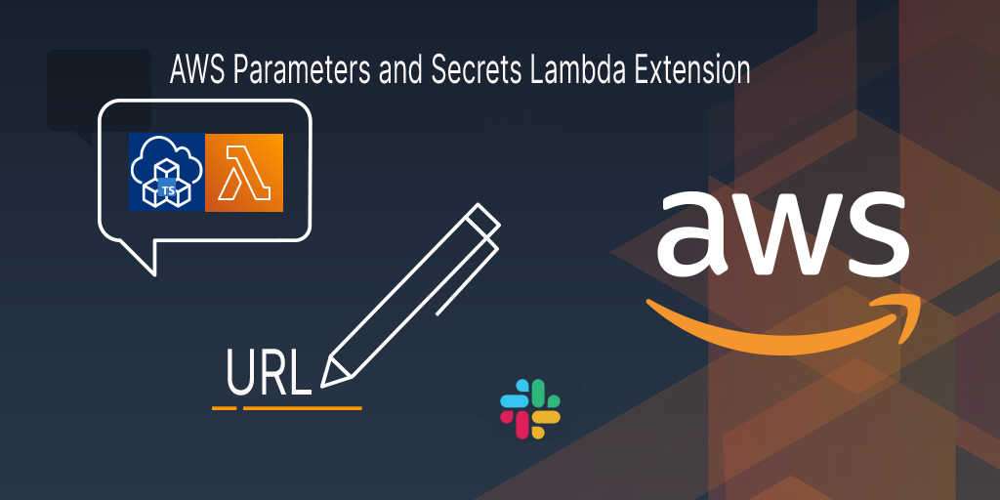

<p align="center">
  <a href="https://dev.to/vumdao">
    
  </a>
</p>
<h1 align="center">
  <div><b>AWS Parameters and Secrets Lambda Extension Demo Using AWS CDK</b></div>
</h1>

## Abstract
- The story: [AWS launched the AWS Parameters and Secrets Lambda Extension](https://aws.amazon.com/jp/about-aws/whats-new/2022/10/aws-parameters-secrets-lambda-extension/), a convenient method for AWS Lambda users to retrieve parameters from AWS Systems Manager Parameter Store and secrets from AWS Secrets Manager. AWS Lambda customers can leverage this extension to improve their application performance as it decreases the latency and the cost of retrieving parameters and secrets.
- [What makes you happy?](https://dev.to/aws-builders/how-to-use-aws-parameters-and-secrets-lambda-extension-16eg) Until now, parameters and secrets were obtained in the Lambda function process using the AWS SDK or other means. With this extension, these values can be cached and reused during the lifecycle of a Lambda function. This reduces the latency and cost of retrieving parameters and secrets.
- This post use AWS CDK Typescript to create lambda function URL where its hanlder gets SecureString value of the parameter store.

## Table Of Contents
 * [Pre-requisite](#Pre-requisite)
 * [How lambda handler get Parameter/Secret value through extension layer](#How-lambda-handler-get-Parameter/Secret-value-through-extension-layer)
 * [Dive deep into CDK code](#Dive-deep-in-to-CDK-code)
 * [Deploy and Demo](#Deploy-and-Demo)
 * [Conclusion](#Conclusion)

---

## 🚀 **Pre-requisite** <a name="Pre-requisite"></a>
- You need slack workspace (free) to create slack incoming-webhooks
- Getting started with AWS CDK

## 🚀 **How lambda handler get Parameter/Secret value through extension layer** <a name="How-lambda-handler-get-Parameter/Secret-value-through-extension-layer"></a>
- To authorize and authenticate Parameter Store requests, the extension uses the same credentials as those used to run the Lambda function itself, so lambda role need to have permission `ssm:GetParameter` and `kms:Decrypt`
- To use the AWS Parameters and Secrets Lambda Extension, we add the extension to the Lambda function as a [layer](https://docs.aws.amazon.com/lambda/latest/dg/invocation-layers.html). The layer ARN differs from region which we can get in [retrieving-secrets_lambda_ARNs](https://docs.aws.amazon.com/secretsmanager/latest/userguide/retrieving-secrets_lambda.html#retrieving-secrets_lambda_ARNs)
- With the above setup, the lambda hander just call to the GetParameter API to retrieve the value with following input
  - Host: `localhost`
  - Port: 2773
  - Header: `X-Aws-Parameters-Secrets-Token` with `AWS_SESSION_TOKEN` environment variable
  - Encode the `queryStringParameters`

- Source code: Here we get the secureString parameter store of slack incoming webhook `SSM_SLACK_WEBHOOK_PRAMETER_NAME='/slack/webhook/url/devops'`
  ```
  def get_ssm_parameter_store():
      SSM_SLACK_WEBHOOK_PRAMETER_NAME = os.getenv(
          'SSM_SLACK_WEBHOOK_PRAMETER_NAME')
      url = 'http://localhost:2773'
      header = {'X-Aws-Parameters-Secrets-Token': os.getenv('AWS_SESSION_TOKEN')}
      parameter_encode = requests.utils.quote(SSM_SLACK_WEBHOOK_PRAMETER_NAME)
      path = f'systemsmanager/parameters/get?name={parameter_encode}&withDecryption=true'
      res = requests.get(f'{url}/{path}', headers=header)
      if res.status_code == 200:
          data = res.json()
          return data['Parameter']['Value']
      else:
          print(
              f"Failed to get SSM parameter store {SSM_SLACK_WEBHOOK_PRAMETER_NAME}")
          return None
  ```

## 🚀 **Dive deep into CDK code** <a name="Dive-deep-in-to-CDK-code"></a>
- The cdk is not much, just includes the follwoing stacks:
  - CMK (custom managed key): This key is to encrypte the parameter store value
  - Lambda role: Provides the function lambda basic execution, `ssm:GetParameter` and `kms:Decrypt` restrict to the above CMK only
  - Lambda function with enable function URL (AuthType: `AWS_IAM`)


## 🚀 **Conclusion** <a name="Conclusion"></a>
- With lambda function url, we don't need to host slackbot in an instance/server, all is serverless. And with AWS CDK, all is managed through code and deploy by cdk-pipeline
- There're many feature from new slack app that you can find out more in the slack API page.

---

References:
- https://slack.dev/bolt-python/tutorial/getting-started

---

<h3 align="center">
  <a href="https://dev.to/vumdao">:stars: Blog</a>
  <span> · </span>
  <a href="https://github.com/vumdao/slackapi-aws-lambda-bolt-python/">Github</a>
  <span> · </span>
  <a href="https://stackoverflow.com/users/11430272/vumdao">stackoverflow</a>
  <span> · </span>
  <a href="https://www.linkedin.com/in/vu-dao-9280ab43/">Linkedin</a>
  <span> · </span>
  <a href="https://www.linkedin.com/groups/12488649/">Group</a>
  <span> · </span>
  <a href="https://www.facebook.com/CloudOpz-104917804863956">Page</a>
  <span> · </span>
  <a href="https://twitter.com/VuDao81124667">Twitter :stars:</a>
</h3>
